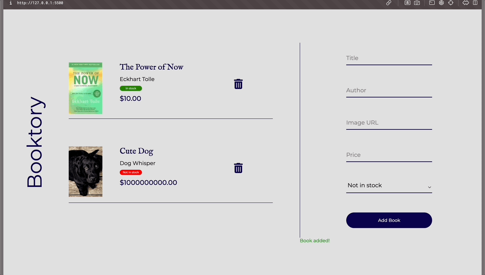

# 📕📗📘&nbsp; Booktory: A Basic Web Application Project

Lets say you have a book store and you want to have a website that holds your book inventory. Well do I have the solution for you. Welcome to Booktory! Here you are able to create an inventory for all the books you own/want. This interactive website allows you to input the data you need to keep track of the books you own or you have interest in acquiring. 

## 🚀&nbsp; Getting Started

This project is aimed at solidifying your understanding of fundamental web development concepts by applying them in a project-based scenario. To get started:

1. **Clone this repository** to your local machine to begin working on your version of Booktory.
2. **Set up your environment** by ensuring you have a modern web browser and a code editor installed.

## 🔮&nbsp; How it Works 

1. Input the title
2. Input the authors name
3. Input the books cover image url (Or any image url)
4. Input the price, be sure to include the decimal and cents (e.g 10.00)

## 📋&nbsp; Functionalities

- **Import any picture**: Use any picture URL from any website to display a cover for the book
- **Add a Book**: Allows you to add a book to the book inventory list 
- **Remove any Book**: Ability to Remove any book from your book Inventory by clicking the trash can
- **Determine Stock**: The stock value is a button that can you press to determine the state of the stock when already on the list

## 🖥️&nbsp; Example 

## ❤️&nbsp; Contributing to the Project

Booktory is a basic project designed for educational purposes. Contributions are welcome, especially from students and educators who wish to improve the project or suggest new features. Whether you're fixing bugs, enhancing the application, or improving documentation, your input is valuable!

## 📫&nbsp; Support and Questions

Encountered a problem or have a question? While this project might not have a dedicated support channel, consider reaching out to your peers, instructors, or use online forums such as StackOverflow. Sharing and solving issues collectively is a great way to learn and grow.

## 🤝&nbsp; Reporting Issues and Suggesting Features

Found a bug or have an idea for a new feature? Feel free to open an issue in this repository with a clear title and description. Contributions are always welcome, and your feedback helps improve Booktory for everyone.

## ✅&nbsp; Requirements

To work on this project, you'll need:

- A modern web browser capable of running JavaScript.
- A text editor or IDE for coding (e.g., VS Code, Sublime Text, Atom).

Knowledge in HTML, CSS, and JavaScript is essential as you'll be working extensively with these technologies.